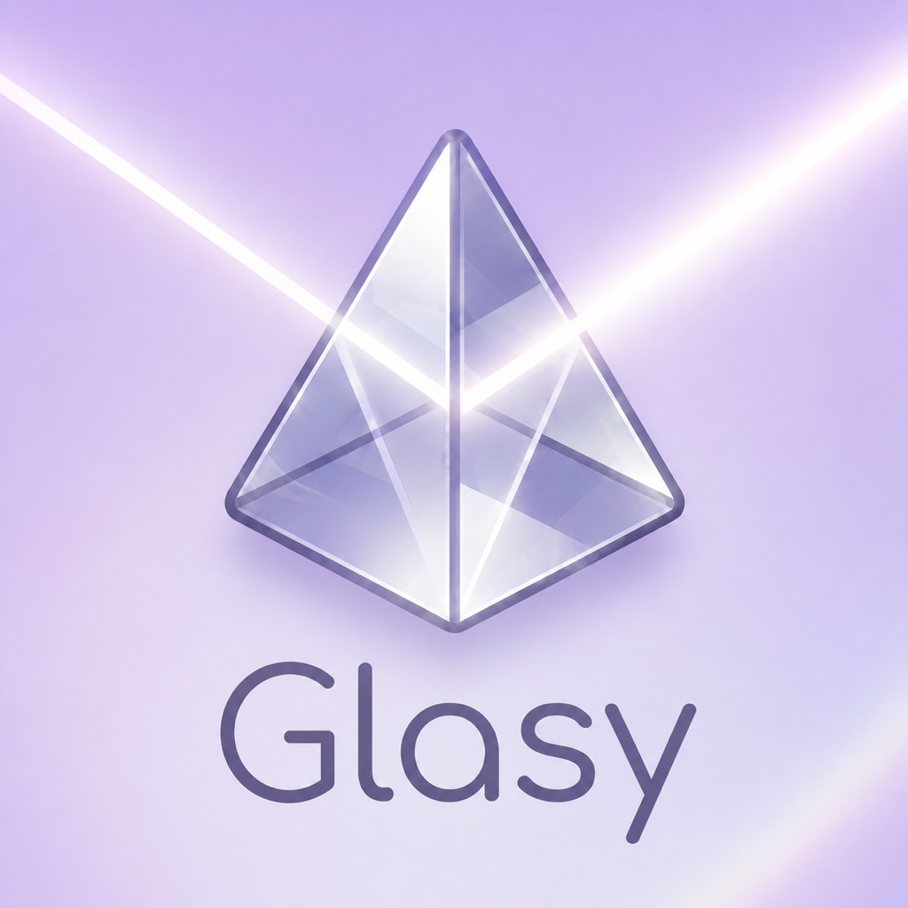

# Glasy

Glasy; Swift, SpriteKit ve SwiftUI ile geliştirilmiş, ışık yollarını yönlendirme üzerine kurulu yerel bir iOS bulmaca oyunudur. Oyuncu, sınırlı hamle hakkıyla aynaları döndürür ve renkli ışınları birleştirerek tüm hedefleri aydınlatmaya çalışır.



## Öne çıkan özellikler

- Çözümü doğrulanmış, tekrarlanabilir bölüm üretim sistemi
- Sabit aynalar, ışın ayırıcılar, renk filtreleri, camlar, portallar ve karma renkli hedefler
- Yeni mekanikleri oyun içinde öğreten bağlamsal eğitimler
- Geri alma, ipucu, bölüm atlama, günlük bulmaca ve günlük giriş ödülü
- iPhone ve iPad ekranlarına uyum sağlayan SpriteKit arayüzü
- VoiceOver etiketleri ve erişilebilir düğmeler
- Google User Messaging Platform ile izin durumuna duyarlı AdMob entegrasyonu
- İsteğe bağlı ödüllü reklamlar ve reklam kaldırma satın alımı
- RevenueCat üzerinden yönetilen StoreKit satın alımları
- Apple gizlilik bildirimi ve yayımlanmış gizlilik politikası desteği

## Mimari

SwiftUI uygulama çatısı, SpriteKit oyun sahnesini ve reklam alanını yönetir. Oyun kuralları ile ışın hesaplamaları görsel katmandan ayrılmıştır. Bu sayede bölüm üreticisi, simülatör açılmadan bağımsız olarak doğrulanabilir.

| Alan | Temel dosyalar |
| --- | --- |
| Uygulama çatısı ve reklam yerleşimi | `GlasyApp.swift` |
| Bulmaca modeli ve ışın hesaplamaları | `LightGame.swift` |
| Tekrarlanabilir bölüm üretimi | `LevelGenerator.swift` |
| Oyun akışı ve görsel sunum | `GameScene.swift` |
| Oyuncu durumu ve gelir modeli | `Monetization.swift` |
| Ortak arayüz bileşenleri | `Utilities.swift` |

## Kullanılan teknolojiler

- Swift 5
- SwiftUI ve SpriteKit
- Google Mobile Ads SDK 11.13.0
- Google User Messaging Platform 2.7.0
- RevenueCat 5.78.0
- Tekrarlanabilir proje yapılandırması için XcodeGen
- En düşük iOS sürümü: iOS 16

## Çalıştırma

1. `Glasy.xcodeproj` dosyasını Xcode ile açın.
2. Swift Package Manager bağımlılıklarının yüklenmesini bekleyin.
3. `Glasy` şemasını seçerek iOS 16 veya daha yeni bir simülatörde ya da cihazda çalıştırın.

`project.yml` değiştirildikten sonra Xcode projesini yeniden oluşturmak için:

```sh
xcodegen generate
```

Geliştirme derlemelerinde Google'ın resmi test reklam birimleri, dağıtım derlemelerinde ise Glasy'nin gerçek reklam birimleri kullanılır.

## Bölüm üretimini doğrulama

Bağımsız doğrulama aracı; üretilen bölümlerin başlangıçta çözülmemiş olduğunu, etkileşimli bir parça içerdiğini ve kayıtlı çözüm adımlarıyla tamamlanabildiğini denetler:

```sh
swiftc -module-cache-path /tmp/glasy-module-cache \
  Glasy/LightGame.swift Glasy/LevelGenerator.swift tools/verify/main.swift \
  -o /tmp/glasy-level-verify
/tmp/glasy-level-verify
```

Mevcut doğrulama aracı, 12 zorluk aralığında toplam 960 bulmacayı sınar.

## Gizlilik ve gelir modeli

Reklam istekleri yalnızca User Messaging Platform reklam gösterimine izin verildiğini bildirdikten sonra başlatılır. Uygulama Takibi Şeffaflığı izni, kullanıcı ödüllü reklam izlemeyi seçtiğinde bağlamsal olarak istenir. Ödül yalnızca reklam SDK'sı izleme koşulunun tamamlandığını bildirdiğinde verilir.

Kaynak kodda bulunan AdMob kimlikleri ve RevenueCat `appl_` anahtarı, sunucu sırrı değil istemci SDK yapılandırma değerleridir. Özel imzalama anahtarları ve yerel ortam dosyaları `.gitignore` ile depo dışında tutulur.

## Proje durumu

Glasy, App Store'da yayımlanan ve geliştirilmeye devam eden bir projedir. Bu depo, iOS istemci uygulamasını ve tekrarlanabilir bölüm doğrulama aracını içerir.

Telif hakkı © 2026 Emre Alkan. Tüm hakları saklıdır.
